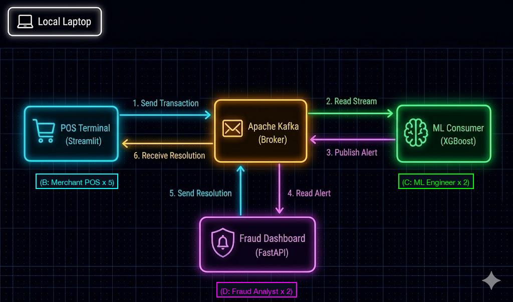

# 🧑‍🤝‍🧑 Organization Simulation Setup (10 Collaborators)

*Note: This 10-person roleplay is specifically designed for the **Stage 1 (Local Kafka)** architecture, as it provides the most hands-on terminal execution for every participant. If you wish to run the simulation using the **Stage 2 (Cloud)** architecture, see the adaptation guide at the bottom of this document.*

Because of the decoupled event-driven architecture, every collaborator can join a massive live simulation. Collaborators configure their `.env` file to point to the Data Engineer's IP address (`BROKER_HOST_IP="[DATA_ENGINEER_IP]"` and `KAFKA_BROKER="[DATA_ENGINEER_IP]:9092"`).

Here is the role breakdown for a 10-person simulation:

## ⚙️ Role A: The Data Engineer (1 Collaborator)
* **Configuration:** Find your local network IP address and broadcast it to the team.
  * **Mac/WSL:** Run `ipconfig getifaddr en0` (or `en1`) in Terminal.
  * **Windows:** Run `ipconfig` in Command Prompt and look for "IPv4 Address".
* **Execution:** Run `docker-compose up -d`
* **Observation:** The headless Kafka broker runs in the background, routing thousands of messages across the network.

## 🛍️ Role B: The Retail Merchant POS Terminals (5 Collaborators)
* **Configuration:** Set `.env` to `BROKER_HOST_IP="192.168.1.15"` and `KAFKA_BROKER="192.168.1.15:9092"`
* **Execution:** Run `streamlit run scripts/pos_terminal_local.py`
* **Observation:** The POS Terminal UI displays. Collaborators click "Start Transactions" to generate simulated retail point-of-sale swipes.

## 🧠 Role C: The ML Engineers (2 Collaborators)
* **Configuration:** Set `.env` to `BROKER_HOST_IP="192.168.1.15"` and `KAFKA_BROKER="192.168.1.15:9092"`
* **Execution:** Run `python scripts/consumer_local.py`
* **Observation:** A scrolling terminal logs the incoming transactions evaluated by the XGBoost model. Kafka automatically load-balances the transaction stream between all active inference workers.

## 🕵️ Role D: The Fraud Analysts (2 Collaborators)
* **Configuration:** Set `.env` to `BROKER_HOST_IP="192.168.1.15"` and `KAFKA_BROKER="192.168.1.15:9092"`
* **Execution:** Run `uvicorn scripts.api_local:app --host 0.0.0.0 --reload`
* **Observation:** Navigate a browser to `http://localhost:8000` to view the interactive dashboard, monitor global alerts in real-time, and execute "Freeze" commands on suspicious accounts.

---

# 🌊 System Architecture Chart

---

# ☁️ Adapting for Stage 2 (Enterprise Cloud Deployment)

If you have already deployed the project to GCP using Terraform, you can still run the organizational simulation! However, because the Cloud architecture uses fully managed serverless components, the roles change significantly:

* **Role A (Data Engineer):** No longer needs to run Docker. Instead, they must ensure the GCP resources are deployed via Terraform. Because Google Cloud blocks unauthenticated traffic, the Data Engineer must generate a Service Account (SA) JSON key and share it with the team to act as a fast "lab password".
* **Role B (Retail Merchants):** Add `GOOGLE_APPLICATION_CREDENTIALS="[path_to_shared_json_key]"` to your `.env` file, then run `streamlit run scripts/pos_terminal_cloud.py`. This key allows your local script to automatically authenticate and push data directly into the Data Engineer's Google Cloud Pub/Sub!
* **Role C (ML Engineers):** **Automated by Cloud Functions!** The ML Engineers no longer run a local consumer script. The serverless GCP Cloud Run Function automatically scales to handle all inference. The ML Engineers can instead log into GCP and monitor the live Cloud Logs and metrics.
* **Role D (Fraud Analysts):** Run `uvicorn scripts.api_cloud:app --host 0.0.0.0 --reload` and connect to the dashboard as usual!
